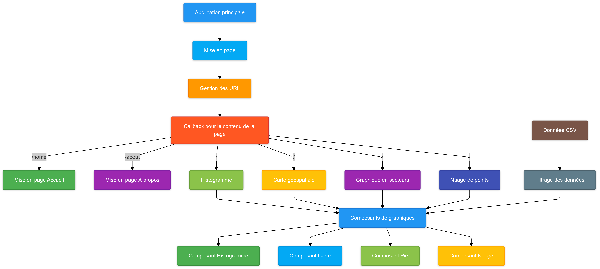

# Dashboard sur la Dépression chez les Étudiants

Ce projet est un tableau de bord interactif créé avec [Dash](https://dash.plotly.com/) qui permet d'explorer les données sur la dépression chez les étudiants. Il propose plusieurs visualisations interactives pour une analyse approfondie.

## User Guide 

### Prérequis
Assurez-vous que Python 3.7 ou une version ultérieure est installée sur votre machine.

### Installation

1. **Cloner le dépôt** :
   ```bash
   git clone https://github.com/TefiniainaR/projet-dashboard-python.git
   cd <projet-dashboard-python>

2. **Créer un environnement virtuel** :
   ```bash
   python -m venv venv
   source venv/bin/activate   # Pour Mac et Linux
   # Sur Windows : venv\Scripts\activate
3. **Installer les dépendances** :
   ```bash
   pip install -r requirements.txt

4. **Préparer les données** :

Veuillez placer le fichier csv nettoyé dans le répertoire       data/cleaned/cleaned_data.csv et assurez-vous que le fichier contiennent ces colonnes : age, city, gender, depression, financial stress, cgpa ( moyenne pondérée cumulative ), latitude, longitude, have you ever had suicidal thoughts ?

5. **Lancer l'application** :
Cela peut se faire en cliquant sur Run dans l'IDE utilisé ou en exécutant la commande suivante dans le terminal : 
   ```bash
   python main.py


6. **Accéder au Dashboard** :
Vous pouvez vous rendre sur le lien indiqué dans le terminal aprés le lancement de l'application : [Dashboard](http://127.0.0.1:8051)

## Data

Les données utilisées dans ce projet proviennent d'un fichier CSV contenant des informations sur les étudiants et leur état de santé mentale. Voici les colonnes principales :
- age : Âge des étudiants
- city : Ville de résidence
- gender : Genre
- depression : Niveau de dépression
- financial stress : Niveau de stress financier
- cgpa : Moyenne cumulative (CGPA)
- latitude et longitude : Coordonnées géographiques des villes
- have you ever had suicidal thoughts ? : Pensées suicidaires (0 = Non, 1 = Oui)

Ce fichier CSV est un [dataset](https://www.kaggle.com/datasets/hopesb/student-depression-dataset) qui provient de la plateforme Kaggle et a été créé par Shodolamu Opeyemi .

## Developer Guide

### Architecture du code

Le projet est organisé de la manière suivante (diagramme réalisé sur Mermaid) : 



### Ajouter une page ou un graphique

Pour ajouter une nouvelle page :
- Créez un fichier Python dans src/pages/ 
- Implémentez la mise en page en utilisant les composants Dash.
- Ajoutez un lien vers cette page dans la navigation principale.

Pour ajouter un nouveau graphique :
- Créez un fichier Python dans src/components/ 
- Implémentez la logique pour générer le graphique avec Plotly ou Dash.
- Intégrez ce graphique dans l'une des pages existantes.

## Rapport d'analyse

Les données révèlent plusieurs tendances clés :

- Les étudiants vivant dans des grandes villes sont plus susceptibles de signaler des niveaux élevés de stress financier.
- Une corrélation négative a été observée entre le stress financier et le CGPA.
- Les étudiants ayant déclaré des pensées suicidaires ont souvent un niveau de dépression très élevé.
- La répartition géographique met en évidence des disparités importantes selon les régions.

## Copyright
Je déclare sur l’honneur que le code fourni a été produit par nous même.
